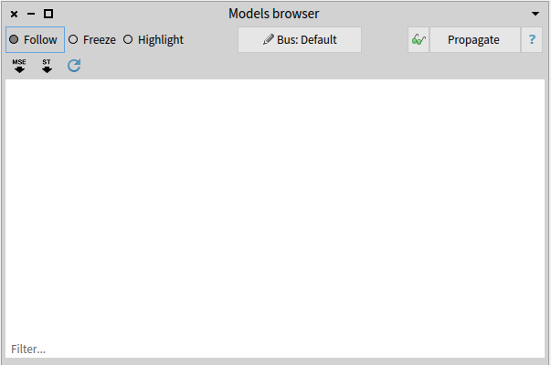
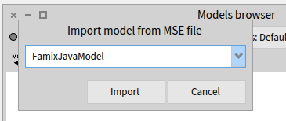
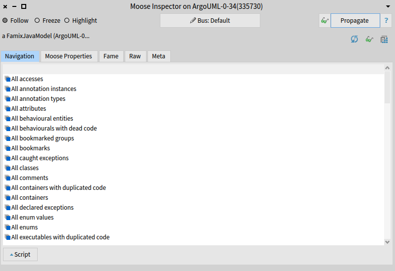
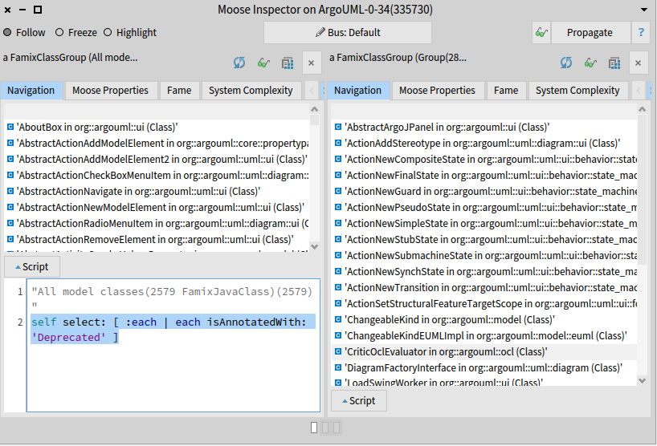
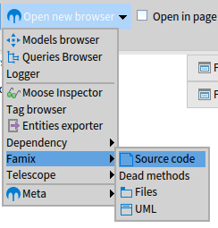
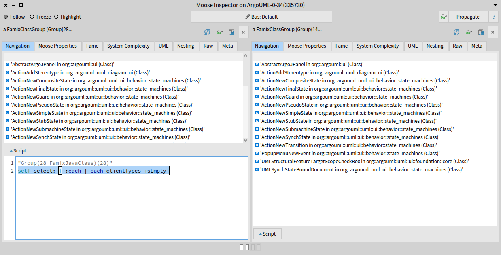

{: .no-lightense}

In this wiki page, we will present couple of analysis examples around a case study.
In our case, we take ArgoUML, an open-source Java project.

## Load Java Code

The system contains some deprecated classes.
A typical question is which of these classes we can remove.
Essentially, this boils down to finding the classes annotated with `@Deprecated` and then selecting those that are not used anywhere (we ignore reflection for this exercise).
This is an analysis.

We first need to build a model of our system, and for this we will use [VerveineJ](../Developers/Parsers/VerveineJ):

- Download and unzip [version 2.0.2](https://codeload.github.com/moosetechnology/VerveineJ/zip/refs/tags/v2.0.2).
- Create an ArgoUML-0-34 folder.
- Download the [ArgoUML version 0.34 sources](https://github.com/argouml-tigris-org/argouml/releases/download/VERSION_0_34/ArgoUML-0.34-src.zip) and place them in ArgoUML-0-34/src folder (the name of the src folder can be arbitrary)
- Download the [ArgoUML version 0.34 libraries](https://github.com/argouml-tigris-org/argouml/releases/download/VERSION_0_34/ArgoUML-0.34-libs.zip) and place them in ArgoUML-0-34/libs folder (the name of the libs folder can be arbitrary)
- Go to the ArgoUML-0-34 folder
- From the command line execute `path/to/VerveineJ/verveinej.bat -o ArgoUML-0-34.mse -autocp ./libs ./src`

The result is that you will get an ArgoUML-0-34/ArgoUML-0-34.mse file with the serialized model that can be loaded in Moose.
Make sure you have [Moose 9.0 or later](InstallMoose).

Starting Moose you see the following window:

{: .img-fill }

Click on the MSE button on the top right and load the ArgoUML-0-34.mse file.

{: .img-fill }

An extra step is to point the model to the sources folder.
To this end, right-click on the ArgoUML-0-34 model, choose Utilities/Set root folder, and point to the ArgoUML-0-34 folder.

Now we are ready to query our system.

## Find deprecated classes

We will first look at deprecated classes.
Inspect the model with a right-click on the model and Inspect.

{: .img-fill }

To retrieve the deprecated classes, select the `All model classes` entry.
Then, open the script area and type the following script:

```st
self select: [ :each | each isAnnotatedWith: 'Deprecated' ]
```

Select the script, and execute it with <kbd>Ctrl</kbd> + <kbd>g</kbd>

{: .img-fill }

In the right pane, you get the list of the deprecated classes in ArgoUML

## Show source code

Just to make sure that we indeed got deprecated classes, let's investigate one of them and select to view the source code.
Select one entity and open the source code browser

{: .img-fill }

Then, by clicking on the **Propagate** button of the inspector, you'll get the source code of the selected class in the source code browser.

{: .img-fill }

## Analyze the result

We now have the 28 classes that are deprecated in our system.
Next, we need to check which of those are not used.
Or if we think in terms of clients and providers, which of the deprecated classes do not have client classes.
Go back to the pane with having 28 classes, open the script area, and execute the following expression:

```st
self select: [ :each | each clientTypes isEmpty]
```

We get 14 classes that can be removed immediately.

{: .img-fill }

To retrive the other classes, execute the following expression:

```st
self select: [ :each | each clientTypes isNotEmpty ]
```

This leaves us with 14 classes that cannot be removed because they are still being used.

## Contributors

This wiki page was first created for [the moosebook](http://www.themoosebook.org/book).
