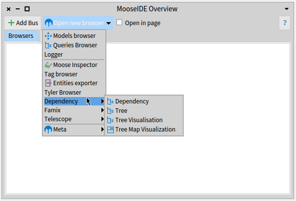
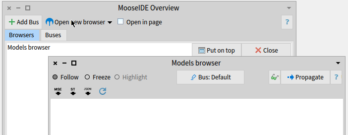
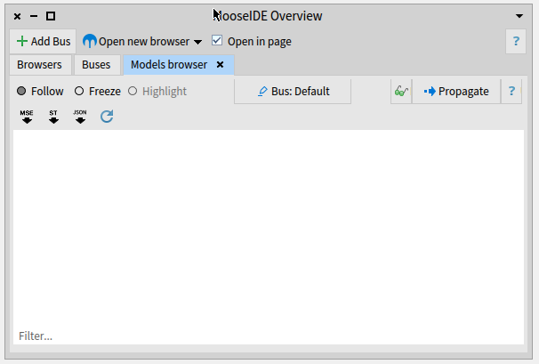
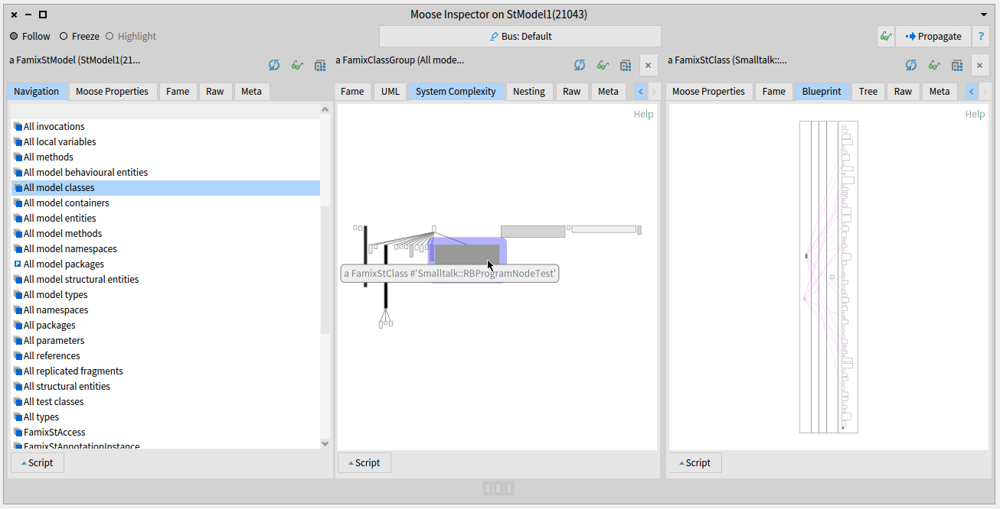
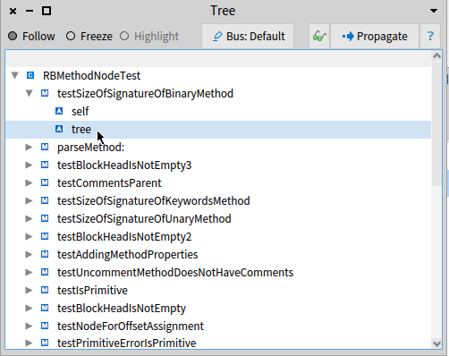
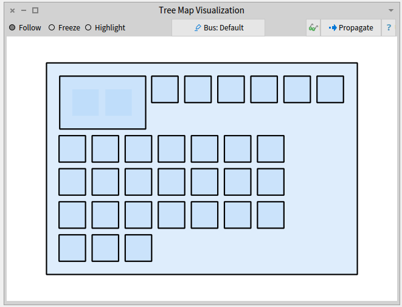
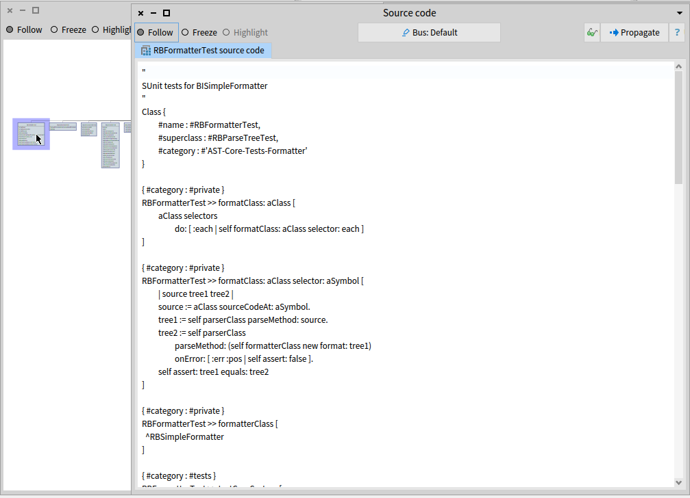
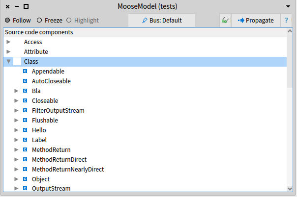
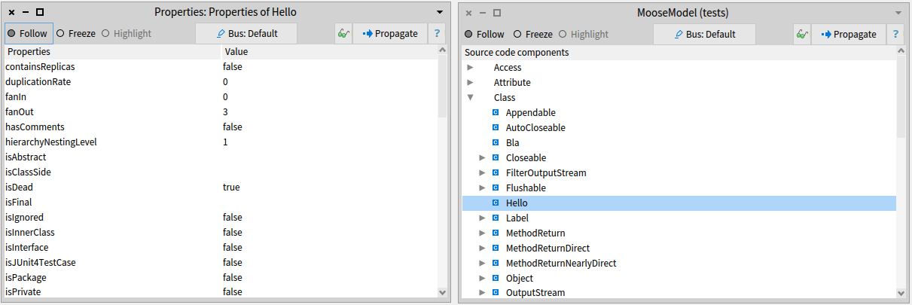

Moose IDE is a group of tools connected the one with the others that one can use to explore a model.
On this page, we group the documentation for each tool.

- [Moose Toolbar](#moose-toolbar)
- [Moose IDE Overview](#moose-ide-overview)
  - [Opening Browser](#opening-browser)
  - [Creating a new bus](#creating-a-new-bus)
- [Models Browser](#models-browser)
- [Queries Browser](#queries-browser)
- [Logger Browser](#logger-browser)
- [Moose Inspector](#moose-inspector)
- [Tree browsers](#tree-browsers)
  - [Tree Browser](#tree-browser)
  - [Tree visualization browser](#tree-visualization-browser)
  - [Tree Map Browser](#tree-map-browser)
- [Famix Browsers](#famix-browsers)
  - [UML Browser](#uml-browser)
  - [Source code Browser](#source-code-browser)
  - [Files Browser](#files-browser)
- [Meta Browser](#meta-browser)
  - [Moose Model Browser](#moose-model-browser)
  - [Properties Browser](#properties-browser)
  - [Fame Browser](#fame-browser)

## Moose Toolbar

The Moose toolbar is a group of entries in the main Pharo toolbar that provides fast access to all the Moose IDE tools.

{: .img-fill .img-center }

The toolbar is divided into three categories.

1. The main tools
2. Specialized tools to perform more advanced query and model exploration
3. Documentation

## Moose IDE Overview

The *Moose IDE Overview* is the entry point to perform analysis with Moose.
It presents the current *Browsers* and *Buses* in the Moose environment.

This browser offers two main features: opening a new browser and creating a new bus.

{: .img-fill .img-center }

### Opening Browser

To open a browser, select in the menu the browser you want to open.

{: .img-fill .img-center }

The browser opens itself in the Moose environment.
Then, you can see an entry in the Moose IDE Overview browser corresponding to this browser.
You can use this entry to close the browser, or to put in on top of the others browser.
This is a nice feature when you have several browsers opened and need to find a specific one.

By checking the `Open in page` checkbox, the browser opens itself inside the Moose IDE Overview browser.
It alows you to keep at the same place every browser you want.

{: .img-fill .img-center }

### Creating a new bus

> Need more documentation here? [open an issue](https://github.com/moosetechnology/moosetechnology.github.io/issues) 

## Models Browser

The *Models Browser* allows one to load a model in the Moose environment.

{: .img-fill .img-center }

They are three ways to load a model:

- With the mse button: load a model store in a MSE file
- With the json button: load a model store in a JSON file
- With the st button: create a Smalltalk model based on the code of the current Moose image

When importing a model from a file (JSON or MSE), a popup appears.
You have to select the kind of model that will be populated.
It is important to select the model that has the correct metamodel.
For instance, to analyze a Java Project, you have to select *FamixJavaModel*.

## Queries Browser

The "Queries Browser" is one of the most powerful tools of Moose.
It allows one to perform advanced queries on any model based on the meta-model.

{: .img-fill .img-center }

There are two panes: the one at the top of the window contains the query performed on the previous result (or the root element), the panel at the bottom presents the result grouped by element type.

To create a new query on the root element, one can click on the green *"+"*, and to create a query on the previous query, one can click on the right-hand arrow and press *Add a child query*.

## Logger Browser

The logger browser keeps a trace of everything you explore (*i.e.* that goes into a bus).

{: .img-fill .img-center }

You can visualize multiple buses, after selecting an element, propagating it again, and clear the logger if too many items are present.

## Moose Inspector

Moose Inspector is an advanced and **convenient** tool to explore a model or any moose entity.

{: .img-fill .img-center }

The moose inspector is divided into several horizontal panels.
Each panel is composed of several tabs.
Standard tabs are *Navigation*, *Moose Properties*, *Fame*.

When inspecting an element, a panel inside the moose inspector is opened.
By default, the *Navigation* tab is also opened.
It allows you to see the other concept linked to the one currently inspected.
For example: when inspecting a Java class, it shows the subclasses, the superclass, and the methods and the attributes of the class.
By selecting an element, a second panel will open next to the original one inspecting the selected elements.

When inspecting specific kind of entity, new tab might appears.
They offer to the end user new way to visualize their data.
For instance, when inspecting a group of classes, on can see it as a UML schema, a system complexity, or with a nesting view.
Or, when inspecting a class, one can see its corresponding blueprint.

It is also possible to perform advanced query from the Moose Inspector.
To do so, by clicking on the script button, one can write any piece of code they want to executed on the inpected entity.

> Be carefull, when performing customized script, you can leave the Moose Environment.
> You may want to learn more Pharo before performing such complex script

## Tree browsers

There are three browsers that allows you to visualize and explore a model and its entity as a tree.
All these browsers can be found under the *Dependency* menu entry.

{: .img-fill .img-center }

### Tree Browser

The *Tree Browser* presents an entity and allows one to explore the contained entities.
For instance, one can see the methods of a class, and the local attribute of a method.

{: .img-fill .img-center }

### Tree visualization browser

When a group of entity is explored, the *Tree Visualization Browser* presents them as a tree.

{: .img-fill .img-center }

In the example, we performed a query that gives us a group of classes and methods.
By propagating the result to the *Tree Visualization Browser*, we got a visualization telling us that these methods are defined in the class.

### Tree Map Browser

The *Tree Map Browser* is a visual way to explore the contained entities.

{: .img-fill .img-center }

In the example, we are exploring the `RBMethodNodeTest` class (as for the Tree Browser example).
The main box represents the class, the box inside it the methods of the classes, and inside the methods are the local variables.
One can click on each box to open or close the box and explore the contained entities.

## Famix Browsers

Some browsers are super useful when exploring an application model (*e.g.* a model of a Java application).
We named this collection of browsers: the *Famix Browsers*.

### UML Browser

The *UML Browser* presents the UML diagram of the selected classes.

In the example, we query the classes that are not a stub.
The *UML Browser* presents us the UML of the application.

### Source code Browser

The *Source code Browser* shows the source code of a selected entity if available.
For instance, when clicking on a class of the preceding example, we get its source code in the *Source code Browser*.

In the example, it shows up the source code of the `RBFormatterTest` class.

### Files Browser

The files browser allows one to explore the model based on the existing files hierarchy.
It is divided into two panes.
The right-hand pane shows a file browser where the user can navigate.
The left-hand pane shows the entities in the model that are present at this level in the file hierarchy (*i.e.* the classes, methods, and attributes defined in the selected directory).

In the example, we retrieve the three classes in the selected folder: `Bla`, `Label`, and `Widget`.
And the user is exploring the `Label` and the `Widget` classes.

## Meta Browser

Meta browsers are browsers that present general information on an entity or a model.

### Moose Model Browser

The *Moose model Browser* presents all model entities grouped by entity type.
It is an excellent browser to select several entities of the same type.

In the above example, the user explores the classes of the model.

### Properties Browser

The *Properties Browser* presents the list of properties of any Moose element.

For example, it can present the number of line of code of a class, the number of methods, *etc.*

### Fame Browser

The *Fame Browser* is a *metamodel developer tool* that shows the existing meta properties of an explored element.

For instance, it allows one to retrieve the navigation properties, the *basic* properties, and their characteristics (*i.e.*, type, derived?, source/target navigation, *etc.*)
