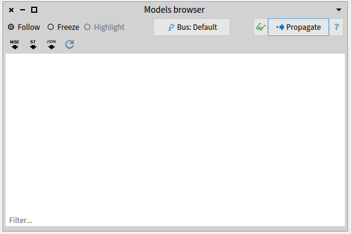

Moose IDE is a group of tools connected the one with the others that one can use to explore a model.
In this page, we group the documentation for each tool.

- [Moose Toolbar](#moose-toolbar)
- [Moose IDE Overview](#moose-ide-overview)
  - [Opening Browser](#opening-browser)
  - [Creating a new bus](#creating-a-new-bus)
- [Models Browser](#models-browser)
- [Queries Browser](#queries-browser)

## Moose Toolbar

The Moose toolbar is group of entries in the main Pharo toolbar that provides a fast access to all the Moose IDE tools.

{: .img-fill }

The toolbar is divided into three categories.

1. The main tools
2. Specialized tools to perform more advanced query and model exploration
3. Documentation

## Moose IDE Overview

The *Moose IDE Overview* is the entry point to perform analysis with Moose.
It presents the current *Browsers* and *Buses* in the Moose envionement.

This browser offers two main features: opening a new browser, and creating a new bus.

{: .img-fill }

### Opening Browser

To open a browser, select in the menu the browser you want to open.

{: .img-fill }

The browser opens itself in the Moose environment.
Then, you can see an entry in the Moose IDE Overview browser corresponding to this browser.
You can use this entry to close the browser, or to put in on top of the others browser.
This is a nice feature when you have several browsers opened and need to find a specific one.

By checking the `Open in page` checkbox, the browser opens itself inside the Moose IDE Overview browser.
It alows you to keep at the same place every browser you want.

{: .img-fill }

### Creating a new bus

> Need more documentation here? [open an issue](https://github.com/moosetechnology/moosetechnology.github.io/issues) 

## Models Browser

The *Models Browser* allows one to load a model in the Moose environment.

They are three ways to load a model:

- With the mse button: load a model store in a MSE file
- With the json button: load a model store in a JSON file
- With the st button: create a smalltalk model based on the code of the current Moose image

When importing a model from a file (JSON or MSE), a popup appears.
You have to select the kind of model that will be populated.
It it important to select the model that have the correct metamodel.
For instance, to analyze a Java Project, you have to select *FamixJavaModel*.

## Queries Browser

The "Queries Browser" is one of the most powerful tool of Moose.
It allows one to perform advanced queries on any model based on the meta-model.

There are two panes: the one at the top of the window contains the query performed on the previous result (or the root elements), the panel at the botom presents the result grouped by element type.

To create a new query on the root element, one can click on the gree *"+"*, and to create a query on the previous query, one can click on the right-hand arrow, and press *Add a child query*.
